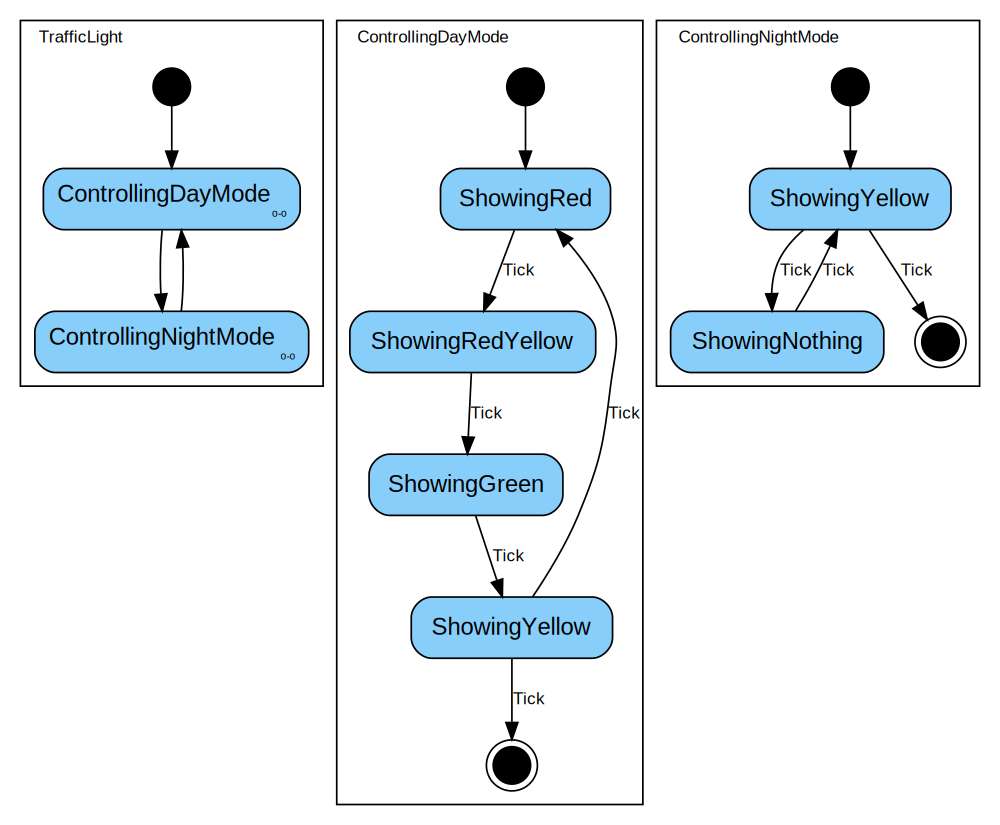

# Just another State Machine

## Introduction

This is an easy-to-use state machine implementation for Kotlin.

There are a lot of variants known to implement state machines.
Most of them merge the code of the state machines behavior together with the functional code.
A better solution is to strictly separate the code of the state machines logic from
the functional code. An existing state machine component is parametrized to define its behavior.

This readme includes the documentation of an implementation of a ready to use FSM (Finite State Machine).
Using this state machine is very simple. Just define the states, the transitions and the state actions.

## Basic steps to create a State Machine

1. Model your state machine inside a graphical editor e.g. UML tool or any other applicable graphic tool.
2. Create all states in your code.
3. Transfer all your transitions from the graphic to the code.
4. Register the action handlers for your states.
5. Start the state machine.

## How to ...

- [Get it.](#gradle)
- [Implementing a simple Finite State Machine.](#how-to-create-a-simple-state-machine)
- [The Classes.](#the-classes)
- [Synchronous vs Asynchronous.](#synchronous-vs-asynchronous)
- [Composite States.](#composite-states)

### Gradle

The library jasm is distributed via MavenCentral.

**build.gradle.kts**

```kotlin
repositories {
  mavenCentral()
}

dependencies {
  implementation("io.github.frantoso:jasm:<version>")
}
```

## How to: Create a simple State Machine

This topic shows how to implement a simple Finite State Machine using the jasm component.
The example shows the modelling of a single traffic light.

### Start with the model of the state machine


*A simple traffic light with four states, starting with showing the red light.*

### Create the state machine and the states

```kotlin
// create the states...
val showingRed = State("ShowingRed")
val showingRedYellow = State("ShowingRedYellow")
val showingYellow = State("ShowingYellow")
val showingGreen = State("ShowingGreen")

// create the state machine...
val fsm =
  fsmOf(
    "simple traffic light",
    // define initial state with transitions and other parameters...
    showingRed
      .entry { println("x--") } // add an entry function
      .transition<Tick>(showingRedYellow), // add one or more transitions
    // define other states with transitions and other parameters...
    showingRedYellow
      .entry { println("xx-") }
      .transition<Tick>(showingGreen),
    showingGreen
      .entry { println("--x") }
      .transition<Tick>(showingYellow),
    showingYellow
      .entry { println("-x-") }
      .transition<Tick>(showingRed),
  )

// start the state machine
fsm.start()

assertThat(fsm.isRunning).isTrue

// trigger an event
fsm.trigger(Tick)

assertThat(fsm.currentState).isEqualTo(showingRedYellow)
```

## The classes

### FsmSync

A synchronous (blocking) state machine. The call to trigger is blocking.

```kotlin
val state = State("MyState")
val fsm =
  fsmOf(
    "MyFsm",
    // add at minimum one state
    state
      .transitionToFinal<Tick>(),
  )

fsm.start()
```

### FsmAsync

An asynchronous (non-blocking) state machine. The call to trigger is non-blocking. The events are
queued and triggered sequentially.

```kotlin
val state = State("MyState")
val fsm =
  fsmAsyncOf(
    "MyFsm",
    // add at minimum one state
    state
      .transitionToFinal<Tick>(),
  )

fsm.start()
```

## Synchronous vs Asynchronous

A function calling trigger() on a synchronous state machine waits until all entry and exit functions
are executed and the transition table was processed. After the trigger() function is returned,
the next function can call trigger().

At an asynchronous state machine the call to trigger only blocks until the event is queued. All
the processing will be executed non-blocking.

Following example shows the difference. The code is identically, only the type of state machine is
 different.

```kotlin
object Event1 : Event()

object Event2 : Event()
```

```kotlin
val output = mutableListOf<String>()
val state1 = State("first")
val state2 = State("second")

fun createFsmSync(): FsmSync =
  fsmOf(
    "MySyncFsm",
    state1
      .transition<Event1>(state2)
      .entry<Int> {
        output.addLast("- $it")
        Thread.sleep(100)
      },
    state2
      .transition<Event1>(state2)
      .entry<Int> {
        output.addLast("- $it")
        Thread.sleep(100)
      }.transitionToFinal<Event2>(),
  )

fun createFsmAsync(): FsmAsync =
  fsmAsyncOf(
    "MyAsyncFsm",
    state1
      .transition<Event1>(state2)
      .entry<Int> {
        output.addLast("- $it")
        Thread.sleep(100)
      },
    state2
      .transition<Event1>(state2)
      .entry<Int> {
        output.addLast("- $it")
        Thread.sleep(100)
      }.transitionToFinal<Event2>(),
  )

fun runFsm(fsm: Fsm): List<String> {
  output.clear()

  fsm.start(42)

  runBlocking {
    launch {
      while (fsm.isRunning) {
        delay(100)
      }
    }

    launch {
      (0..5).forEach {
        output.addLast("+ $it")
        fsm.trigger(dataEvent<Event1, Int>(it))
        delay(10)
      }

      fsm.trigger(dataEvent<Event2, Int>(-1))
    }

    launch {
      (10..15).forEach {
        output.addLast("+ $it")
        fsm.trigger(dataEvent<Event1, Int>(it))
        delay(1)
      }
    }
  }

  output.forEach {
    println(it)
  }

  return output.toList()
}

val outputAsync = runFsm(createFsmAsync())
assertThat(outputAsync.takeLast(10).filter { it.startsWith("+") }).hasSize(0)

val outputSync = runFsm(createFsmSync())
assertThat(outputSync.takeLast(5).filter { it.startsWith("+") }.size)
  .isGreaterThanOrEqualTo(2)
```

The output produced by both calls to `runFsm()`:

| synchronous | asynchronous |
|:-----------:|:------------:|
|    - 42     |    - 42      |
|     + 0     |     + 0      |
|     - 0     |     - 0      |
|    + 10     |     + 10     |
|    - 10     |     + 11     |
|     + 1     |     + 1      |
|     - 1     |     + 12     |
|    + 11     |     + 2      |
|    - 11     |     + 13     |
|     + 2     |     + 3      |
|     - 2     |     + 14     |
|    + 12     |     + 4      |
|    - 12     |     + 15     |
|     + 3     |     + 5      |
|     - 3     |     - 10     |
|    + 13     |     - 11     |
|    - 13     |     - 1      |
|     + 4     |     - 12     |
|     - 4     |     - 2      |
|    + 14     |     - 13     |
|    - 14     |     - 3      |
|     + 5     |     - 14     |
|     - 5     |     - 4      |
|    + 15     |     - 15     |
|    - 15     |     - 5      |

## Composite States

This library also supports nested state machines through composite states.

A composite state can be build from the scratch or encapsulated in a class derived from `CompositeState`.

### The diagram of the nested state machine



*A traffic light with normal operation over the day and flashing yellow in the night.*

### Nested State Machine as Composite State

When deriving from the `CompositeState` class, the sub state machine must be part of the state and
will be added automatically to the parent state machine when used.

```kotlin
class ControllingDayMode : CompositeState() {
  private val showingRed = State("ShowingRed")
  private val showingRedYellow = State("ShowingRedYellow")
  private val showingYellow = State("ShowingYellow")
  private val showingGreen = State("ShowingGreen")

  override val subMachines =
    listOf(
      fsmOf(
        name,
        showingRed
          .transition<Tick>(showingRedYellow),
        showingRedYellow
          .transition<Tick>(showingGreen),
        showingGreen
          .transition<Tick>(showingYellow),
        showingYellow
          .transition<Tick, Boolean>(showingRed) { it!! }
          .transition<Tick, Boolean>(FinalState()) { !it!! },
      ),
    )
}
```

### Nested State Machine - manually created

A composite state can be also created by using a normal state as base and adding one or more child
machines when creating the parent state machine.

```kotlin
val showingNothing = State("ShowingNothing")
val showingYellow = State("ShowingYellow")

val fsmNight =
  fsmOf(
    "ControllingNightMode",
    showingYellow
      .transition<Tick, Boolean>(showingNothing) { !it!! }
      .transition<Tick, Boolean>(FinalState()) { it!! },
    showingNothing
      .transition<Tick>(showingYellow),
  )
```

### Putting all together

The parent machine with two composite states.

```kotlin
val controllingDayMode = ControllingDayMode()
val controllingNightMode = State("ControllingNightMode")

val trafficLight =
  fsmOf(
    "TrafficLight",
    controllingDayMode // is a composite state - child is added automatically
      .transition<NoEvent>(controllingNightMode),
    controllingNightMode // normal state to use as a composite state
      .child(fsmNight) // child must be added manually
      .transition<NoEvent>(controllingDayMode),
  )
```

